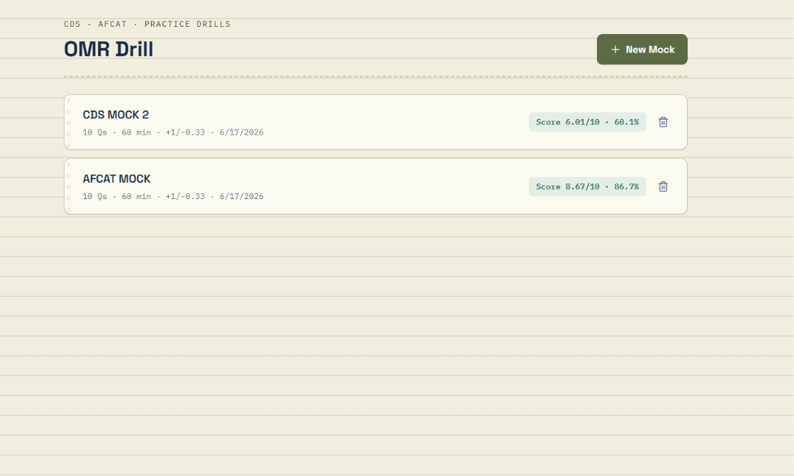
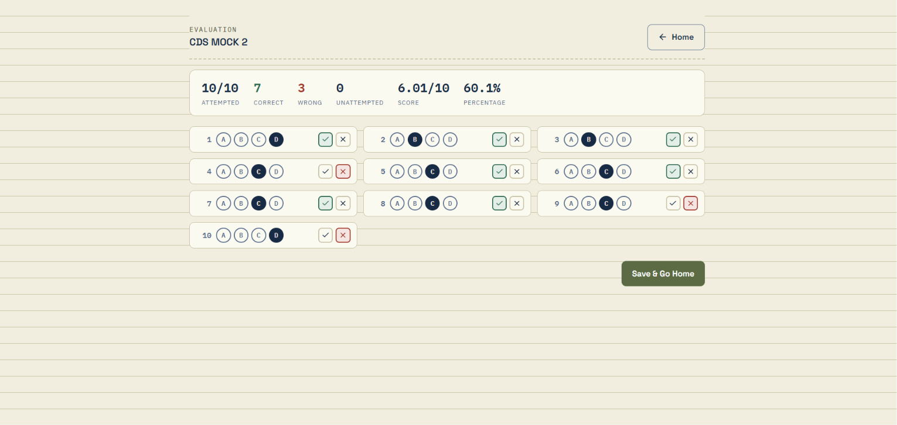

# OMR Drill 🎯

A beautiful, lightning-fast digital OMR (Optical Mark Recognition) practice sheet built for aspirants of competitive exams like CDS, AFCAT, and others. OMR Drill runs directly in your browser, allowing you to practice timed mocks with ease.

## 🚀 Features

- **Customizable Exams**: Set the number of questions, total time limit, and specific marking schemes (positive and negative marks).
- **Built-in Timer**: Keep yourself honest with an automated countdown timer.
- **Instant Evaluation**: Review your attempts, mark answers as correct or wrong, and instantly calculate your total score, accuracy, and percentages.
- **100% Private**: Everything is stored locally on your device using the browser's Local Storage. No logins required, and no one else can see your data.
- **Responsive Design**: Beautiful, distraction-free UI.

---

## 📸 How It Works

### 1. Home Dashboard
Keep track of all your past mock attempts, pending evaluations, and final scores at a glance.
<br>


### 2. Set Up Your Sheet
Create a new mock by defining the title, number of questions, duration, and the marking scheme.
<br>


### 3. Take the Exam
Mark your answers exactly like you would on an OMR sheet. A timer runs at the top so you can pace yourself.
<br>


### 4. Self-Evaluation & Results
Once submitted, check your answers against the answer key. The app instantly tallies your attempted, correct, wrong, and unattempted questions to calculate your final score!
<br>


---

## 💻 Getting Started (Local Development)

To run this project on your own machine:

1. **Clone the repository:**
   ```bash
   git clone https://github.com/pyvmag/OMR-Drill.git
   cd OMR-Drill
   ```

2. **Install dependencies:**
   ```bash
   npm install
   ```

3. **Run the development server:**
   ```bash
   npm run dev
   ```

4. **Open your browser:**
   Navigate to [http://localhost:3000](http://localhost:3000) to see the app in action.

## ☁️ Deployment

Since this is a standard Next.js application, the easiest way to deploy is through [Vercel](https://vercel.com). Simply import your GitHub repository to Vercel and it will automatically build and deploy your app. Every user that visits the URL will have their own independent, private environment!
